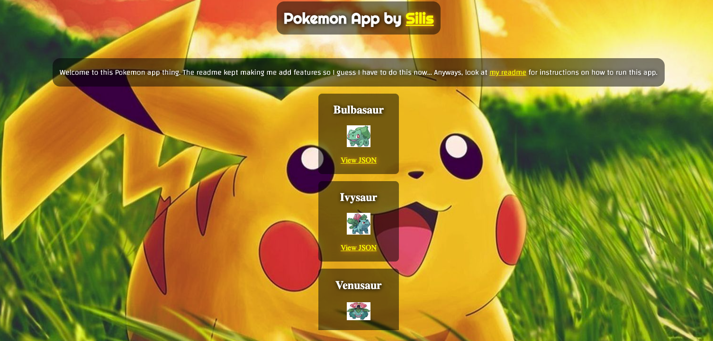

# How to run this app
## Steps:
1. Run `npm install` to install any dependencies.
2. Run `npm start` in your terminal to begin the back-end server.
3. Start `"Live Server"` from `/index.html`.
## Notice:
* Make sure you have a `.env` variable that says `"PORT=xxxx"`.

This app has a 2 front-end files: `/index.html` and `/index.js`, as well as 2 back-end files: `/app.js` and `/server.js`.

    

